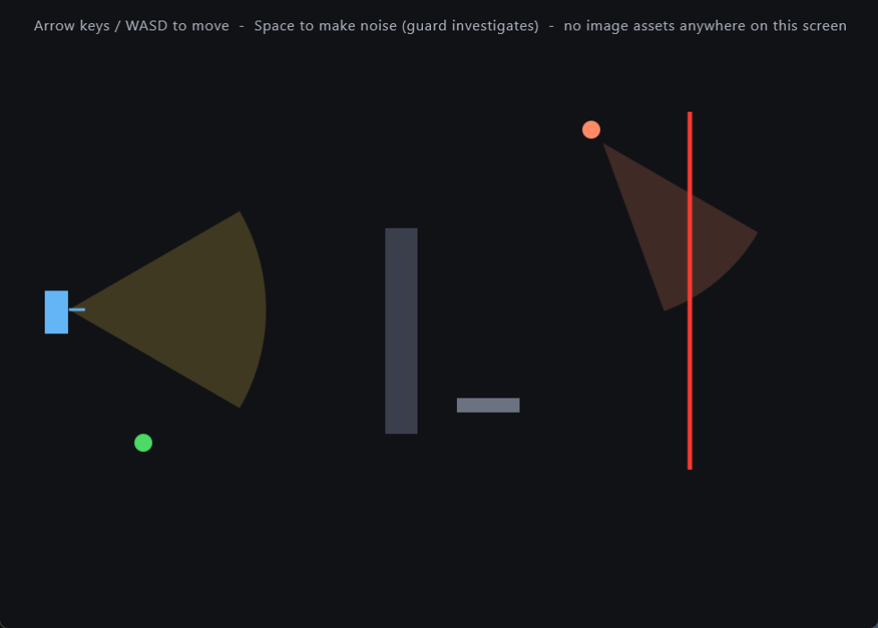

# KMP Stealth Game Toolkit

A small, pure Kotlin Multiplatform toolkit for building 2D stealth games: occluder-aware vision
cones, patrolling guards, sweeping security cameras, timed laser hazards, moving platforms and
conveyors, plus a few general-purpose utilities that shipped alongside them.

Zero platform APIs, zero rendering, zero assets - every type here is plain data and math. You
bring the renderer (KorGE, Compose Canvas, LibGDX-on-JVM, raw SVG, whatever); this library just
tells you where things are and what they can see.

Built for and extracted from [**Infiltrate: Shadow Heist**](https://github.com/MalithaBandara/infiltrate-shadow-heist),
a stealth platformer shipping on Android and iOS - every piece here has been driving real,
shipped levels.

## Install

```kotlin
repositories {
    maven("https://jitpack.io")
}

dependencies {
    implementation("com.github.MalithaBandara:kmp-stealth-game-toolkit:v1.0.0")
}
```

JitPack resolves the coordinate above regardless of this project's internal Maven `group`
(`io.github.malithabandara`) - that's JitPack's own scheme (`com.github.<owner>:<repo>:<tag>`), not
a typo.

## What's in it

| Package | What it does |
| --- | --- |
| `geometry` | 2D vector/segment/rect math, segment intersection, raycasting, line-of-sight checks. The foundation everything else sits on. |
| `vision` | `VisionSystem.computeVisionPolygon` - an occluder-aware field-of-view cone as a renderable polygon, with crisp shadow edges at occluder corners. Plus spotted-distance checks against one or several target points, so a body mostly behind cover can still register once enough of it is exposed. |
| `actors` | `Guard` - patrols a route, turns around at obstacles or route ends, investigates a noise or a lost sighting, then returns to patrol. |
| `sentry` | `Camera` - sweeps between two angles, optionally pausing at each end, and pauses its sweep entirely while it has a target in view. |
| `hazards` | `Laser` - a timed on/off beam (tiltable up to 45 degrees from vertical) that can be permanently switched off via a caller-owned trigger id. |
| `platforms` | `MovingPlatform` (smooth sinusoidal motion, gated activation, one-shot re-arming) and `Conveyor`/`ConveyorCrate` (belt-driven drift, looping, patrolling, vertical bob). |
| `follow` | `SmoothFollow` - a one-dimensional critically damped spring for a camera (or any value) that should chase a moving target without the jolts a plain lerp produces. |
| `layout` | `ScreenLayout` - sizes a fixed-design-resolution 2D canvas to any device's aspect ratio without ever letterboxing or cropping, plus safe-area-inset conversion into virtual canvas units. |
| `physics` | `BoxPhysics` - a small impulse-based rigid-box solver. See "About the physics" below before assuming it's more than it is. |

## About the physics

`BoxPhysics` is **not a general physics engine**, and the README would be dishonest if it implied
otherwise. It simulates exactly one box at a time against a list of axis-aligned obstacles (static
rects, or ones riding a movable body like a cart) - no box-vs-box, no arbitrary polygons, no
joints. Within that narrow scope it does real, standard impulse-based physics: accumulated-impulse
contact resolution (the same family of technique used inside Box2D), restitution only on genuine
impacts so a resting box doesn't buzz, Coulomb friction, and a sleep state once a box has settled.
It exists because most 2D game engines - including the one this library was extracted from - don't
ship a physics engine at all, and a general-purpose one is usually overkill for "make a crate that
falls off a hook tumble and settle believably."

## Quick example

```kotlin
import io.github.malithabandara.stealthkit.actors.Guard
import io.github.malithabandara.stealthkit.geometry.Rect
import io.github.malithabandara.stealthkit.vision.VisionSystem

val guard = Guard(x = 0.0, y = 0.0, patrolMinX = 0.0, patrolMaxX = 300.0)
val walls: List<Rect> = levelWalls()

fun tick(dt: Double, playerPosition: Rect) {
    guard.update(dt, obstacles = walls)

    val spottedAt = VisionSystem.getPlayerSpottedDistance(
        guard = guard,
        targetPoints = listOf(playerPosition.topLeft, playerPosition.bottomRight),
        occluders = walls
    )
    if (spottedAt != null) {
        // render an alert, fail the level, whatever your game does on detection
    }

    // for rendering the vision cone itself:
    val cone = VisionSystem.computeVisionPolygon(
        origin = guard.eyePosition,
        facingAngle = guard.facingAngle,
        range = guard.visionRange,
        fov = guard.visionFov,
        occluders = walls
    )
}
```

## Demo

`demo/` is a separate Gradle build (Compose Multiplatform, desktop target) that drives every piece
above using nothing but circles, rectangles and lines - no image assets - to prove the library
needs none. See [`demo/README.md`](demo/README.md) for how to run it.



The bend in both vision cones where they meet the gray wall is `VisionSystem` actually raycasting
against the occluder, not a cosmetic clip.

## Targets

`jvm`, `androidTarget`, `iosArm64`, `iosSimulatorArm64`, `js`, `wasmJs`. Every type in this library
is pure `kotlin.math`/`kotlin.concurrent` - there are no platform-specific APIs - so all six targets
build clean in CI.

## License

MIT - see [LICENSE](LICENSE).
